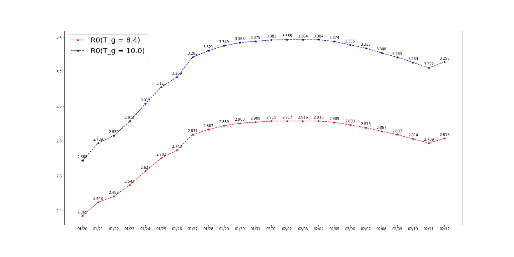

## Learning infectious disease model

data from National/Hubei/Wuhan health commission(data updated up to  2020/02/05/23:59)

### power function - y = a * (x**b) + c 
#### Daily Number


------


#### Daily Increment


#### Forecast Infection Number tomorrow / Updated on 6th Feb 2020

Date(as of 23:59) | Forecast(F) | Reality(R) | Difference(F-R) 
:------------------: | :------------: | :----------: | :---------------: 
2020/02/06 | 32384 ||


### R0 

R0 表示再生指数，即一个人可以传染给多少人

[reference1](https://zhuanlan.zhihu.com/p/104091330?from=timeline)

```
${\lambda} = \frac{ln(Y(t)}{t} ：表示早期感染人数增长率，Y(t)表示截止到t时间的感染人数$
$R_0 = (1+ \frac{\lambda}{r_1})* (1+ \frac{\lambda} {r_2}) ：r_1表示处于潜伏期的人以r_1的概率转变为受感染人，r_2表示处于感染期的人以r_2的概率转变为康复期$
$记T_L = \frac{1}{r_1},T_I = \frac{1}{r_2} ，则生成时间记为T_g = T_L + T_I，记p = \frac{T_L}{T_g}为潜伏期占生成时间的比例$
$以上，推导：R_0 = 1+\lambda * T_g + p*(1-p)(\lambda*T_g)^2$
```


部分参数来源于[reference2](https://www.kechuang.org/t/85075)中所介绍的论文

$T_g 分别取8.4 和10.0 做两组实验，p值取0.695，疫情开始的时间取12月8号，到1月20号晚23点59分记为43天$



