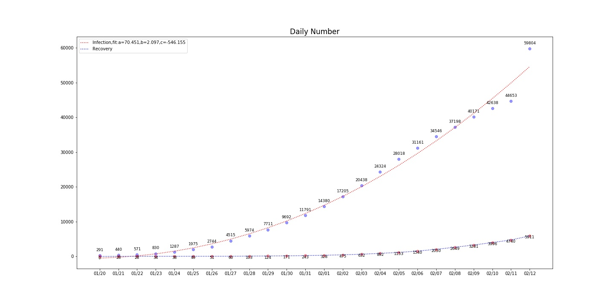

## Learning infectious disease model

data from National/Hubei/Wuhan health and construction commission

### exponential model - y = a * exp(-b*x) + c 

#### Updated on 5th Feb 2020

Date(as of 23:59) | Forecast(F) | Reality(R) | Difference(F-R) 
:------------------: | :------------: | :----------: | :---------------: 
2020/02/04     |    25154    | 24324      | 830            
2020/02/05     |    29494                 

